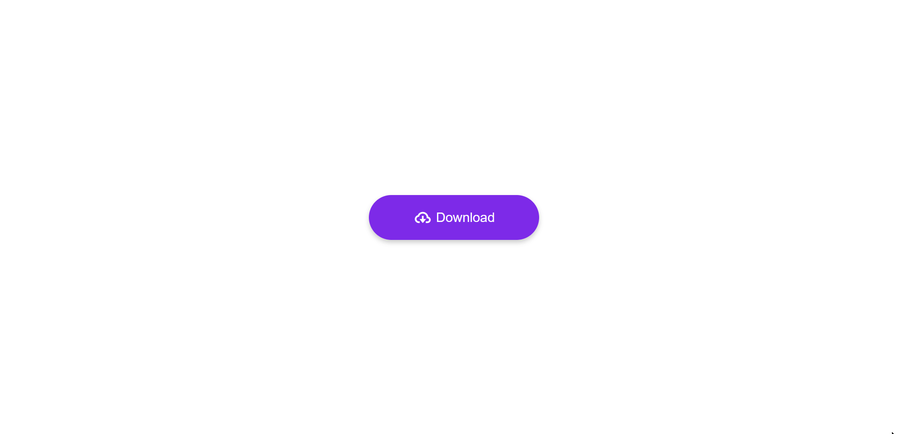

# Download Button

This project is a simple UI implementation of a download button with progress bar.


## Demo




# Installation

To use this project on your own machine, clone the repository and open the index.html file in your web browser.

```bash
  git clone
```

Go to the project directory

```bash
  cd download-button
```
Open index.html in your browser

```bash
  open index.html
```


